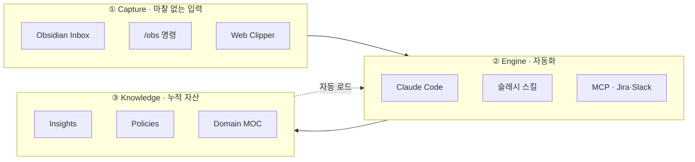

# 🧠 QA Knowledge Vault

> 휘발되는 QA 경험을 자산으로 누적하기 위해 직접 만든 개인용 지식 관리 시스템입니다.
> Obsidian 위에 Claude Code를 얹어, 결정·이슈·정책을 자동으로 분류·연결·재사용합니다.


---

## 👋 About

QA로 일하면서 가장 자주 부딪힌 문제는 **"같은 자리를 맴돌고 있다"** 는 감각이었습니다.
비슷한 패턴의 회귀를 두 번째 만났을 때, 작년의 제가 어떻게 해결했는지 기억이 흐릿했습니다.
회의록은 노션에 잘 남기는데, 그게 정말 제 지식이 되어 있는지에 대한 의심이 커졌습니다.

이 저장소는 그 의심에서 출발한 개인 실험의 설계와 템플릿입니다.

---

## ❓ 왜 만들었나

세 가지 질문에서 시작했습니다.

> **Q1.** AI로 인해 정보가 쏟아지는데, 내가 이걸 온전히 받아내고 기억할 수 있을까?
>
> **Q2.** 노션·컨플루언스 같은 공식 문서로 히스토리는 잘 남기는데, 이게 정말 나의 지식이 되고 있는가?
>
> **Q3.** ISTQB의 **경험기반 테스팅(Experience-based Testing)** 을 빠른 배포 사이클에서 어떻게 더 와닿게 할 수 있을까?

세 질문의 공통 뿌리는 **외부의 정보가 내 안의 지식으로 변환되지 않는다**는 점이었습니다.

→ 그래서 공식 문서(팀 정렬용)는 그대로 두고, 그 옆에 **개인 vault(나의 회상용)** 를 따로 두는 구조로 설계했습니다.

---

## 🧱 시스템 구조

3개 레이어로 느슨하게 분리되어 있어, 한 부분이 바뀌어도 시스템 전체가 흔들리지 않습니다.



- **Capture** — 무엇을 어디에 둘지 고민하지 않고 일단 받아둡니다. 분류는 나중에 합니다.
- **Engine** — Claude Code 위에 만든 슬래시 스킬이 분류·생성·정리를 수행합니다.
- **Knowledge** — 시간이 지날수록 가치가 누적되는 자산입니다. 다른 폴더는 결국 여기를 채우기 위한 통로입니다.

---

## 📁 폴더 구조 (PARA 변형)

Tiago Forte의 PARA에 QA 직무용 폴더 3개(Inbox · Policies · Issues)를 추가했습니다.

```
vault/
├── 0. Inbox/                  → 임시 보관. 주 1회 정리
├── 1. Projects/               → 진행 중 프로젝트. 기능당 폴더 1개
│   └── {기능명}/
│       ├── main.md                 메인 스펙
│       ├── 📐 requirements.md      FR · AC · Open Question
│       ├── 🧪 test-plan.md         영향 범위 · 회귀 · TC
│       └── 📝 decision-log.md      append-only · 시간순 D번호
├── 2. Policies/               → 도메인별 운영 정책
├── 3. Issues/                 → 연도별 이슈 히스토리
├── 4. Resources/              ⭐ 진짜 자산이 쌓이는 곳
│   ├── insights/                   원자 단위 재사용 가능 원칙
│   └── moc/                        도메인 지식 지도 (Map of Content)
├── 5. Archive/                → 완료 프로젝트 보관
└── CLAUDE.md                  → 세션마다 자동 로드되는 컨텍스트 레이어
```

→ 가장 중요한 폴더는 `4. Resources/` 입니다. 나머지는 결국 여기를 채우기 위한 통로입니다.

---

## ⚡ 슬래시 스킬

반복되는 분류 결정을 명령어로 박제했습니다. "이번에도 이 폴더로 옮길까?" 같은 작은 마찰이 사라집니다.

- `/new-project {티켓번호}` → 티켓·위키를 자동 수집해 4파일 세트 생성
- `/close-project {티켓번호}` → 인사이트 추출 · 정책 갱신 · MOC 백링크 · 아카이브 이동
- `/new-issue` → 6섹션 템플릿(발견·현상·원인·대응·인사이트·재발방지)으로 이슈 노트 생성
- `/inbox-cleanup` → 인박스 노트를 인사이트 / 이슈 / 정책으로 자동 분류 (멱등성 보장)
- `/obs {내용}` → 현재 컨텍스트에 맞춰 vault 적절한 위치로 자동 라우팅 (append-first)
- `/qa-tc-writer` → 명세에서 ISTQB 기반 TC 자동 도출 (정상 · 엣지 · 회귀)

---

## 🔄 프로젝트 라이프사이클

티켓 수신부터 종료까지 5단계로 정해뒀습니다.

1. **Capture** — 외부 정보 유입 → 인박스에 일단 저장 (`/obs` · Web Clipper)
2. **Initiate** — `/new-project` → 티켓·위키 자동 수집, 4파일 세트 생성
3. **Execute** — 매일의 결정을 `D1, D2, ...` 시간순으로 append (절대 수정하지 않음)
4. **Close** — `/close-project` → 인사이트·정책·이슈 추출 후 정식 폴더로 이식, 아카이브 이동
5. **Curate** — 주 1회 인박스 정리. 외부 글은 인사이트로 변환

→ 5단계가 끝나면 다시 1단계로 순환합니다.
→ **다음 프로젝트는 이전 프로젝트의 인사이트·정책·MOC를 자동으로 컨텍스트로 받습니다** (`CLAUDE.md` 자동 로드).

---

## 💬 Slack → Vault 자동 동기화

가장 빠른 의사결정은 메신저에서 일어나는데, 가장 빨리 휘발되는 곳도 메신저입니다.

이 시스템에서 가장 도움이 된 흐름 중 하나는 슬랙 스레드를 vault에 자동으로 흡수하는 기능입니다.

> 스레드 URL 던지기 → AI가 스레드 전체 fetch → 기존 프로젝트 문서와 diff → 누락된 결정·이슈 보고 → 승인 시 자동 반영

→ 실제 운영 중 한 번은 65개 메시지짜리 스레드에서 미기록 버그 1건 + 신규 팔로업 티켓 1건을 발견해 `D12`, `D13`으로 결정 로그에 자동 append했습니다.

---

## 🛡️ Guardrails

AI가 자동으로 문서를 작성하는 시스템에서 가장 위험한 단일 실패 모드는 **그럴듯한 추측이 사실처럼 박제되는 것** 입니다.

실제로 한 번 발견했습니다. 명세 검토 중 ✅로 표시된 항목에서 근거를 추적할 수 없었고, AI가 빈칸을 "합리적 디폴트"로 메운 결과였습니다.

그 사고 이후로 4개 규칙을 `CLAUDE.md`에 박았습니다.

- **출처 없는 ✅ 금지** — 모든 사실 행은 `D번호` · 링크 · 검증 메모 중 하나가 필수. 누락 시 자동 `(확인 필요)` 처리
- **결정 적용 범위 명시** — 구두·영상 합의에서 추출한 결정은 발화 범위를 넘어 일반화 금지
- **5문항 자가 점검** — 명세 작성 후 5개 체크리스트 통과 시에만 사용자에게 제출
- **정정 이력 보존** — 잘못된 항목은 삭제하지 않고 `정정 이력`으로 명시. 결정 로그는 append-only

---

## 🛠️ Tech Stack


- **Obsidian** — 로컬 마크다운 vault · Dataview로 MOC 자동 집계 · iCloud 동기화
- **Claude Code** — 파일시스템 접근 · 커스텀 슬래시 스킬 · MCP 연동
- **MCP 서버** — 외부 데이터 (Jira 티켓 · Slack 스레드 · Confluence 명세) 자동 수집
- **`CLAUDE.md`** — 세션마다 자동 로드되는 컨텍스트 레이어 (시스템의 핵심)

→ 자체 개발 코드 없음. 모두 기성 도구 조합.

---

## 📌 현재 상태

active iteration 중인 개인 실험입니다.

### 🔢 누적 자산

> vault 자체가 시스템의 산출물입니다. 시간이 지날수록 숫자가 커집니다.

- 📑 **인사이트 12건** — 재사용 가능한 원자 단위 교훈
- 📜 **운영 정책 4건** — 도메인별 운영 규칙
- 🐛 **이슈 히스토리 3건** — 6섹션 구조로 박제된 회귀·버그
- 🗄️ **완료 프로젝트 3건** — `/close-project`로 자산 추출 후 아카이브
- 🗺️ **도메인 MOC 3건** — 영역별 지식 지도
- ⚡ **슬래시 스킬 약 10개** — 반복 결정 자동화

### ✅ 작동 중

- 5단계 라이프사이클 명령어 전체
- Slack ↔ vault 동기화 (MCP 경유)
- 프로젝트 종료 시 도메인 MOC 자동 백링크 갱신
- 4개 가드레일 룰을 `CLAUDE.md`에 박아 작성 시점에 강제

### 🔬 진행 중

- 프로젝트 부트스트랩 시점의 시맨틱 인사이트 검색 (MOC 링크만으로는 한계)
- 과거 이슈 패턴 → TC 자동 도출
- 크로스 프로젝트 회귀 패턴 surfacing

### 📈 측정 계획

거창한 KPI 대신 **부담 없이 자동으로 누적되는 것** 위주로 잡았습니다.

- **vault 자산 카운트** — 폴더별 파일 수. `ls | wc -l` 한 줄. 주 1회 확인.
- **인사이트 재참조 횟수** — Dataview 쿼리 1줄로 자동 집계. 한 인사이트가 다른 프로젝트에서 백링크된 수가 곧 재사용 가치입니다.
- **부트스트랩 시간 1회 비교** — 다음 새 프로젝트 1건만 수동 vs `/new-project` 시간을 재둡니다. 1회면 충분합니다.

### 🌱 체감 변화 (정성)

- 같은 질문을 두 번 검색하는 일이 줄었습니다.
- 익숙한 도메인의 새 티켓에서 AI가 *"이번엔 X 영역 회귀를 우선 확인하세요"* 라고 짚어주기 시작했습니다.
- 슬랙에서 결정이 흐른 직후 vault에 박혀, 다음 주에 "어디서 합의했더라" 검색하는 시간이 줄었습니다.
- 한 슬랙 스레드(65개 메시지)에서 미기록 결정 2건을 자동으로 발견해 D12·D13으로 결정 로그에 append한 사례가 있었습니다.

---

## 🎯 설계 원칙

설계에 깔린 다섯 가지 원칙입니다.

1. **캡처 마찰이 시스템을 죽인다** — 작성 시점 분류 0. 정렬은 나중에 합니다.
2. **수정보다 누적** — 결정 로그는 문서가 아니라 타임라인입니다.
3. **인사이트는 한 줄로 충분** — "공유 컴포넌트 정책 변경 시 호출처 전수 검증" 같은 한 줄이 다음 회귀를 막아줍니다.
4. **AI는 저자가 아니라 내비게이터** — 가치는 vault에 있습니다. AI는 vault 사용의 활성화 에너지를 낮춰주는 역할입니다.
5. **공식 문서와 개인 vault는 대체재가 아니다** — 노션은 팀 정렬용, vault는 개인 회상용. 나란히 삽니다.

---

## 📬 Contact

- 📝 Blog : [rae-gi.tistory.com](https://rae-gi.tistory.com)
- 💼 LinkedIn : [linkedin.com/in/raeyoung-lee](https://www.linkedin.com/in/raeyoung-lee/)
- ✉️ Email : raeyoung.works@gmail.co

---

> *경험이 휘발되지 않고 누적되도록 만들어보려는 QA 엔지니어의 실험입니다.*
